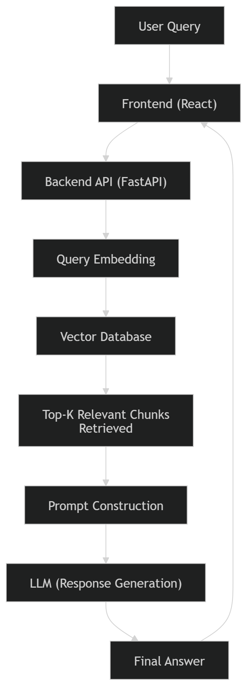

# RAG Assistant – BAJA Rulebook QA System

##  Demo

### Frontend


##  Overview

This is a **full-stack Retrieval-Augmented Generation (RAG) system** designed to query **BAJA SAE rulebooks and technical documents** using natural language.

Instead of manually searching through PDFs, users can simply ask questions like:

 *“What are the safety rules in BAJA?”*

The system returns:

*  Context-aware answers
*  Relevant document chunks (sources)
*  Retrieval scores for transparency

All answers are **grounded in actual document data**, reducing hallucination.


##  Why this project?

Traditional chatbots hallucinate due to lack of context.
This system uses Retrieval-Augmented Generation (RAG) to:
- Ground responses in real documents
- Improve factual accuracy
- Provide source-backed answers


##  How It Works

1. **Document Processing**

   * Rulebook PDFs are cleaned and split into structured chunks (sections/paragraphs)

2. **Embedding Generation**

   * Each chunk is converted into a vector using **Sentence Transformers**

3. **Vector Storage**

   * Embeddings are stored in **ChromaDB** for efficient similarity search

4. **Query Processing**

   * User query is embedded into the same vector space

5. **Retrieval**

   * Top-k relevant chunks are retrieved based on semantic similarity

6. **Response Generation**

   * Retrieved context is passed to **Ollama (phi3)** to generate a grounded answer

7. **Frontend Display**

   * Final output includes:

     * Generated answer
     * Source chunks
     * Similarity scores


ARCHITECTURE DIAGRAM




## System Flow

1. User enters query in frontend
2. Backend converts query → embedding
3. Vector DB retrieves relevant chunks
4. Context + query sent to LLM
5. Response returned with sources


SYSTEM FLOW

Step 1: User Query
The user enters a query through the frontend interface.

Step 2: Query Processing
The backend receives the query via an API call.
The query is converted into vector embeddings using an embedding model.

Step 3: Retrieval
The generated embedding is compared with stored document embeddings in the vector database.
Top-K most relevant chunks are retrieved based on similarity.

Step 4: Context Construction
The retrieved chunks are combined with the original query.
A structured prompt is created to guide the language model.

Step 5: Response Generation
The prompt is passed to the language model (LLM).
The model generates a context-aware response using the retrieved information.

Step 6: Response Delivery
The generated response is sent back to the frontend.
The answer is displayed to the user (along with sources if implemented).


##  Tech Stack

Frontend: React  
Backend: FastAPI  
Embeddings: (mention model)  
Vector DB: (FAISS / Chroma etc)  
LLM: (OpenAI / local / etc)


##  Setup Instructions

### Backend
cd backend
pip install -r requirements.txt
uvicorn main:app --reload

### Frontend
cd frontend
npm install
npm run dev
```

### 5. Open in Browser

```
http://localhost:5173
```

---

##  Example

#Input

```
What are the safety rules in BAJA?
```

Output

* Generated answer
* Supporting document chunks
* Retrieval similarity scores

---

 Future Improvements

- Better chunking strategies
- Hybrid search (BM25 + embeddings)
- Streaming responses
- Multi-document support

---

 Author

**Rudra Naresh**
Electronics Engineering, VJTI
